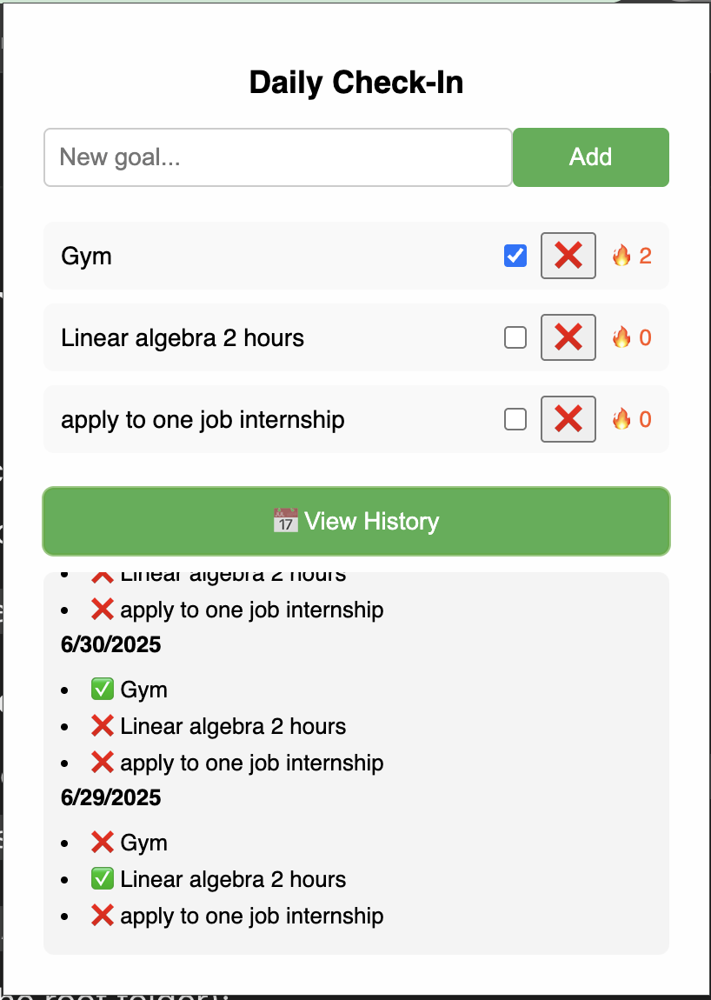

# 🗓️ Daily Check-In – Chrome Extension

A Simple Chrome extension that helps you **track daily habits**, **build streaks**, and **helps people stay consistent**. Add custom goals, check them off daily, and view your full history in a clean interface.

## 🚀 Features

- ✅ Add and remove custom daily goals
- 📅 Automatically resets checkboxes each day
- 🔥 Tracks goal streaks (like Snapchat)
- 🕒 Full completion history by date
- Simple and responsive design

## 📸 Screenshots

## 🧠 How It Works

- The extension stores your goals and progress using `chrome.storage.local`.
- Each day, it checks if a new date has started and resets the checklist.
- History and streaks are saved per goal and updated dynamically.

## 🧪 Installation (Developer Mode)

1. Clone or download this repository.
2. Go to `chrome://extensions` in your browser.
3. Enable **Developer Mode** (top-right).
4. Click **Load unpacked** and select this project folder.
5. You’re ready to go!

## 📝 File Structure

DAILY-CHECKS/
├── icons/
│ └── icon.png
├── image/
│ ├── logo.png
│ └── screenshot.png
├── manifest.json # Chrome extension configuration file
├── popup.css # Styles for the extension UI
├── popup.html # HTML structure of the extension popup
├── popup.js # JavaScript logic for daily tracking
├── README.md # Project documentation

## 📄 License

This project is open source and available under the [MIT License](LICENSE).
